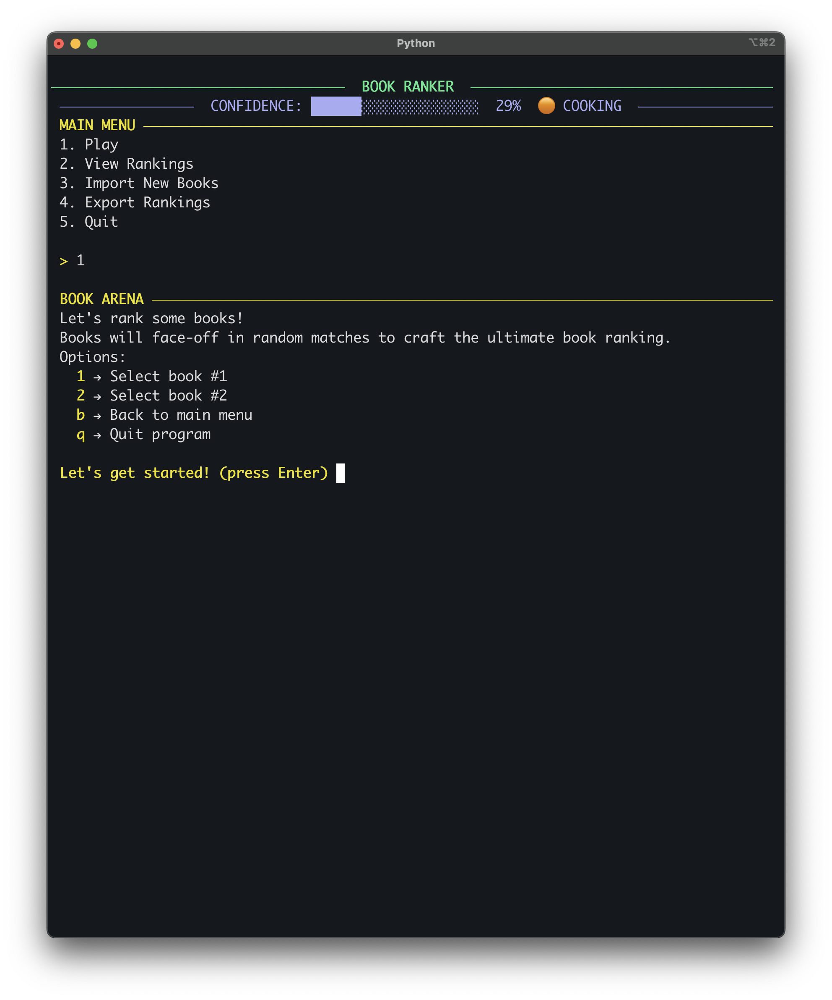
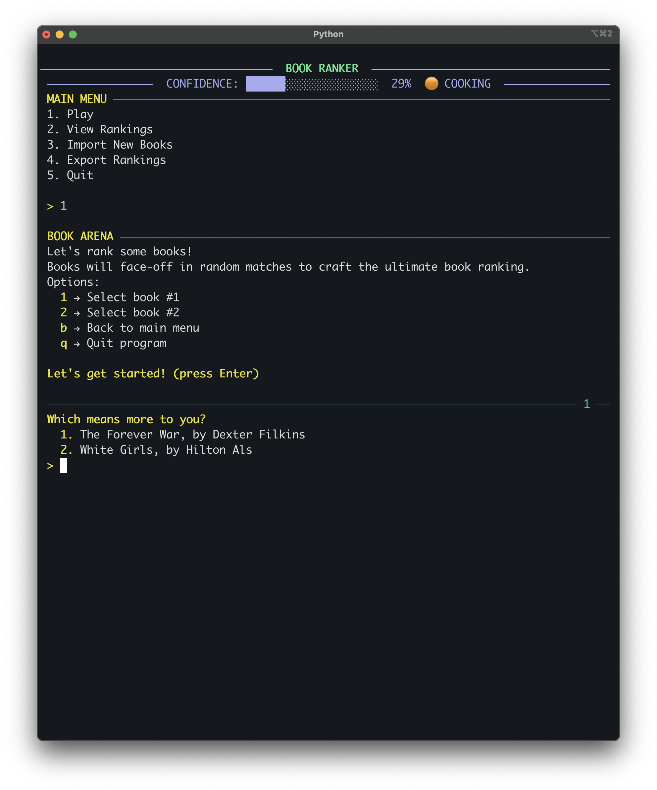
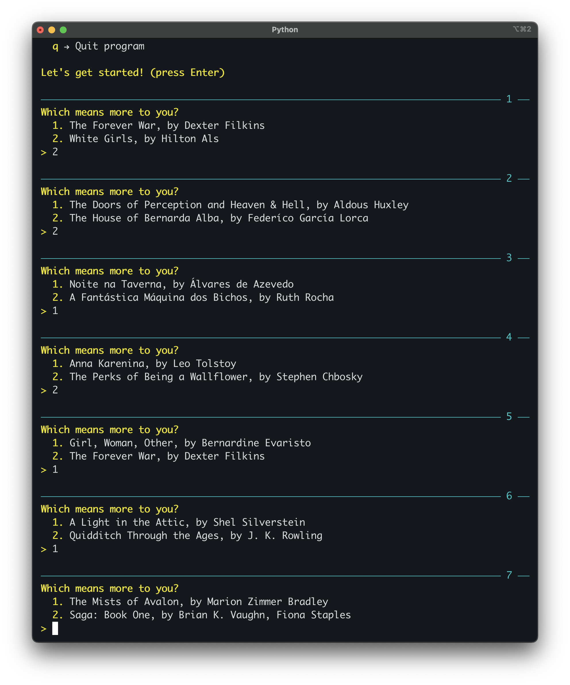
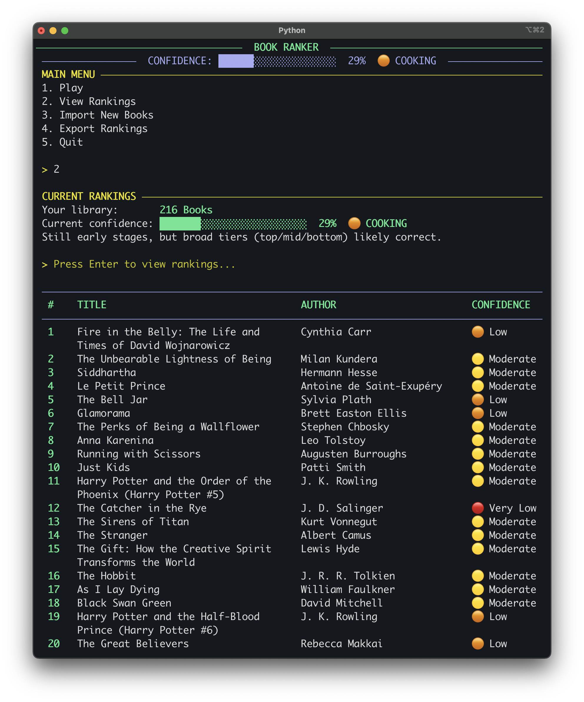
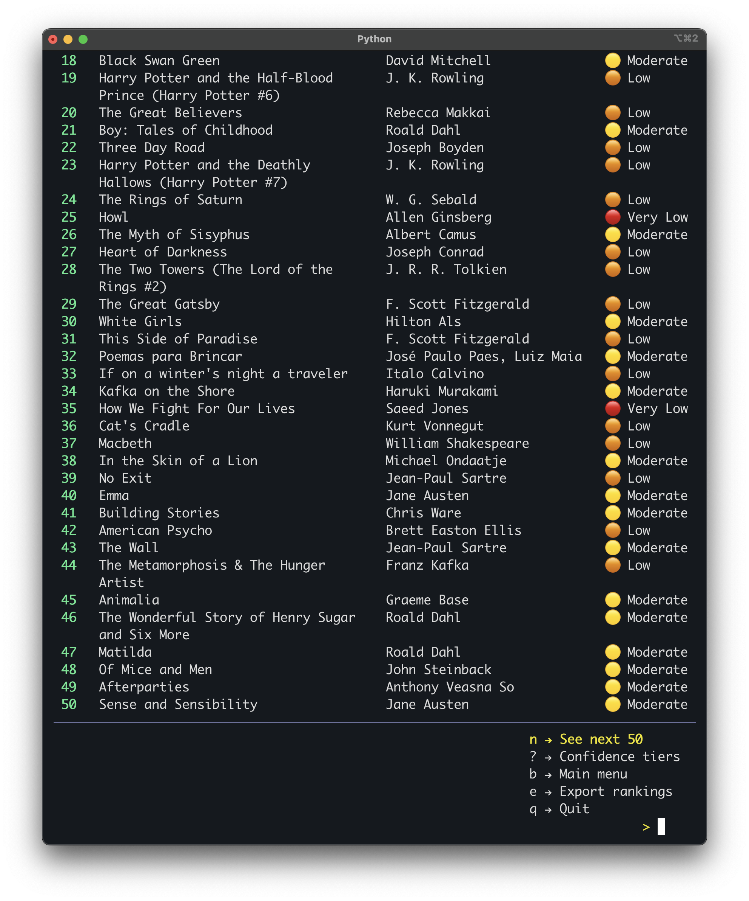

# 📚 Book Ranker


You've read dozens (hundreds?) of books and vaguely know you like some better than
others. But which one was actually your favourite? Your top 20? Top 42? And was that
rating of 7 you gave in 2021 really fair compared to the 8 you handed out last week?

Book Ranker cuts through the noise by turning your reading log into a tournament. It pits
two books head-to-head and asks one simple question:

> Which book means more to you, A or B?

Over time, an Elo-based rating system does the math and builds a ranked list that
reflects your ultimate breakdown. No more stuttering when someone asks you what your 33rd
favorite book of all time is. Those days are over!

## 🪄 Preview

<details>
<summary><b>&nbsp;Screenshots of latest version</b></summary>

<h3>Book Arena:</h3>




<h3>View Rankings:</h3>




</details>

## 🪩 Features

- CSV import from your reading log (format: title, author, rating)
- Book Arena: head-to-head book comparisons on loop
- Elo-based ranking system with confidence tiers and variable K values
- Smart matchmaking: prioritize books with lower confidence rating, similar Elo scores,
  and unmatched pairs
- Persistent rankings via SQLite to build accurate data over time
- Confidence indicators in the ranking display
- Add new books at any time
- Export your rankings to CSV

## 📋 Requirements

- Python 3.x
- [Rich](https://github.com/Textualize/rich) — terminal formatting

## ⚙️ Setup

1. Clone the repo:
   ```bash
   git clone https://github.com/rafacmaia/book-ranker.git
   cd book-ranker
   ```


2. Create a virtual environment and activate it:
   ```bash
   python -m venv .venv
   source .venv/bin/activate
   ```


3. Install dependencies:
   ```bash
   pip install -r requirements.txt
   ```


4. Run the app:
   ```bash
   python main.py
   ```
   In the first run, you'll be prompted to import your book log from a CSV file.


5. To run on sample or test data instead of your own library:
   ```bash
   python main.py --test
   ```
   *Note, a sample CSV with 20 books is included at [
   `data/sample-books.csv`](data/sample-books.csv) to get you started.*

## 📃 CSV Format

Your CSV file should have the following columns:
> title, author, rating

Where rating is a number from 1 to 10, inclusive. Decimals encouraged!

Example:

```csv
title,author,rating
Confessions of a Mask,Yukio Mishima,6.5
The Republic,Plato,8
"Rich Dad, Poor Dad",Robert Kiyosaki,3.5 
Just Kids,Patti Smith,9
```

## 📖 How It Works

Each book starts with an Elo score derived from your initial rating (1–10 scale, mapped
to a range of 800–1200). Every time you pick one book over another, both scores are
updated using the Elo formula. Books are then ranked by their Elo score and displayed
with a confidence tier indicating how much data is behind their current position. The Elo
K value also adapts to confidence, so books with fewer matchups are more volatile at
first, while well-matched books settle into stable rankings, unlikely to vary much more
from then on.

### Confidence Tiers

- 🔴 Very Low: fewer than 10% of possible matchups played
- 🟠 Low: 10–20% of matchups played
- 🟡 Moderate: 20–60% of matchups played
- 🟢 High: 60–80% of matchups played
- ✅ Very High: 80%+ of matchups played

## 🗂️ Project Structure

| File                               | Description                       |
|------------------------------------|-----------------------------------|
| [`main.py`](main.py)               | Entry point and main menu         |
| [`game.py`](game.py)               | Game loop and Elo logic           |
| [`models.py`](models.py)           | Book class                        |
| [`db.py`](db.py)                   | Database setup and queries        |
| [`csv_handler.py`](csv_handler.py) | CSV import and export logic       |
| [`display.py`](display.py)         | Rankings display and UI constants |
| [`state.py`](state.py)             | Global state management           |

## 🗺️ Roadmap

- [X] Track confidence tiers for Elo ratings to indicate the reliability of current
  rankings
- [X] Improve matchmaking (prioritize books with similar Elo scores, unmatched pairs,
  and lower confidence ratings)
- [X] CSV export of final rankings
- [ ] Handle tied Elo scores (e.g., by initial rating, head-to-head comparison, and
  confidence rating)
- [ ] Support for adding/removing individual books
- [ ] Undo option for mistakes (track and undo the last 1–3 face-offs)
- [ ] Filter rankings by genre, author, or year read (e.g., "2021" or "Fantasy")
- [ ] Web terminal; serve the CLI interface via browser (Flask + xterm.js)
- [ ] Web UI, full browser-based interface (longer term)
  
